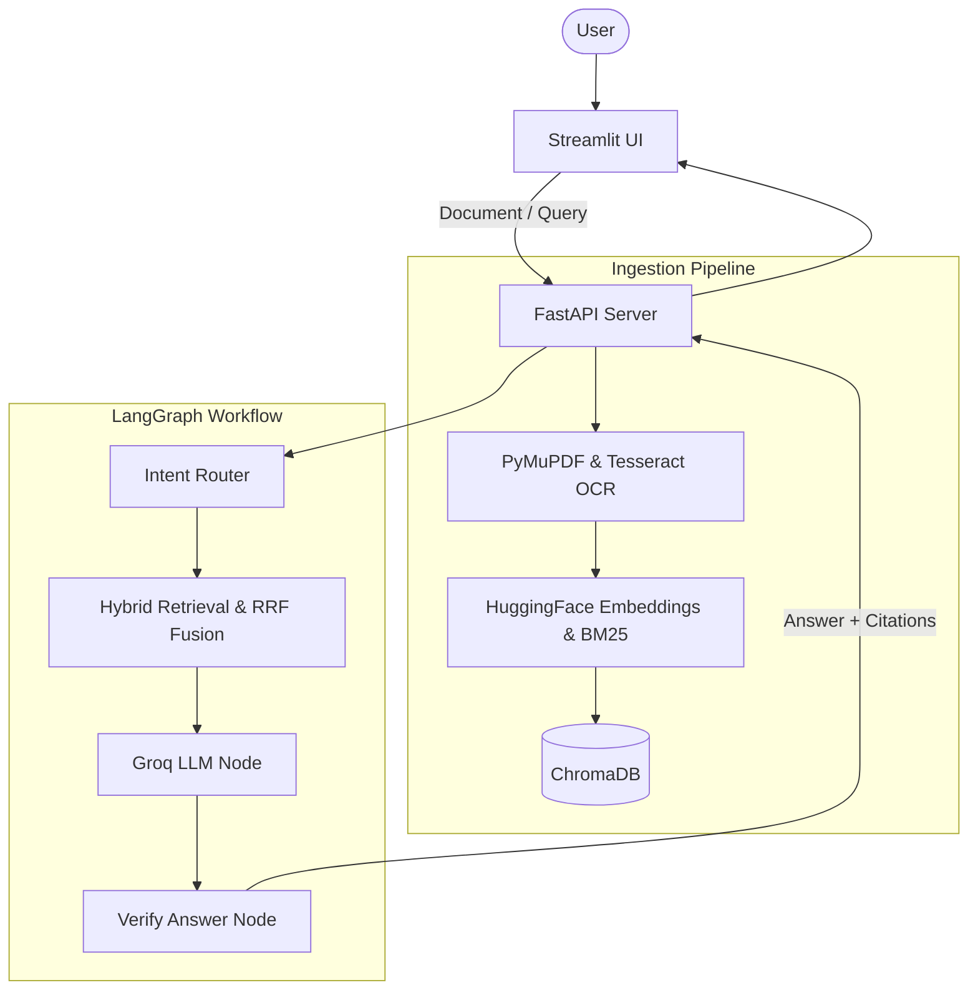

# DocuMind

DocuMind is an open-source Multimodal Document QA and RAG platform. It processes complex PDF documents containing native text, scanned pages, data tables, embedded images, and mathematical equations.

Powered by **LangGraph**, **FastAPI**, and **Streamlit**, DocuMind combines hybrid vector/BM25 retrieval, automatic claim verification, and side-by-side interactive PDF page citations.

---

## Features

- **Multimodal PDF Processing**: Extracts text, structured tables into Markdown, embedded images, and runs Tesseract OCR on scanned pages.
- **Hybrid Retrieval (Vector + BM25)**: Fuses dense similarity search (ChromaDB + HuggingFace) and sparse keyword matching (BM25) with neighboring page context expansion.
- **LangGraph Agent Workflow**: Dynamically routes queries across text RAG, table analysis, AST math evaluation, and web search fallback.
- **Answer Grounding Verification**: Audits factual LLM claims against retrieved context, returning an explicit verification status and grounding score.
- **Interactive Page Citations**: Renders PDF pages into PNGs. Clicking citation links opens the exact PDF page render side-by-side in the UI.
- **Web Search Fallback**: Automatically searches the web via DuckDuckGo when document context is missing.
- **Isolated Multi-Doc Sessions**: Manages independent chat threads with strict metadata isolation in ChromaDB.

---

## Tech Stack

| Layer | Technology | Purpose |
| :--- | :--- | :--- |
| **Frontend** | Streamlit | Interactive web GUI & side-by-side page viewer |
| **Backend API** | FastAPI + Uvicorn | Async REST API backend and web server |
| **Workflow Engine** | LangGraph | State machine routing, retrieval, & verification |
| **LLM Provider** | Groq / Gemini / Ollama | LLM inference engine (defaults to Groq `llama-3.3-70b-versatile`) |
| **Embeddings** | HuggingFace (`all-MiniLM-L6-v2`) | Local 384-dimensional sentence vectors |
| **Vector DB** | ChromaDB | Persistent local vector store with metadata filtering |
| **Sparse Retrieval** | Haystack BM25 | BM25 lexical keyword matching |
| **PDF Processing** | PyMuPDF + Tesseract OCR | Text extraction, table detection, OCR, & page rendering |

---

## Architecture



---

## How It Works

1. **Upload & Process**: PDF text, tables, and images are extracted. Scanned pages automatically trigger Tesseract OCR.
2. **Chunk & Index**: Content is embedded and indexed in ChromaDB and Haystack BM25.
3. **Hybrid Retrieve & Route**: Query triggers dense vector + BM25 keyword search with neighbor expansion, routed by LangGraph.
4. **Generate & Verify**: LLM generates an answer, which is fact-checked against retrieved context for grounding.
5. **Display & Cite**: Response is rendered with clickable citations that open rendered PDF pages side-by-side.

---

## Project Structure

```
documind/
├── app/
│   ├── api/                # FastAPI REST routes (/upload, /query, /documents)
│   ├── document/           # PDF processor, OCR, table extractor, & safe AST math
│   ├── graph/              # LangGraph state machine, nodes, & workflow
│   ├── models/             # LLM provider manager (Groq, Gemini, Ollama)
│   ├── rag/                # Embeddings, ChromaDB vector store, & BM25 retriever
│   └── tools/              # DuckDuckGo web search fallback
├── data/                   # Persistent storage (ChromaDB, JSON logs, page PNG renders)
├── frontend/               # Streamlit web UI (streamlit_app.py)
├── tests/                  # Pytest test suite
├── pyproject.toml          # Project dependencies
└── README.md               # Documentation
```

---

## Setup

### Prerequisites
- **Python**: 3.10, 3.11, or 3.12
- **Tesseract OCR**: Installed on system path (`sudo apt install tesseract-ocr` or Windows installer)

### Installation

```bash
# Clone repository
git clone <repository_url>
cd documind

# Install dependencies with uv (recommended)
uv sync

# Or with pip
pip install -e .
```

---

## Environment Variables

Create a `.env` file in the root directory (see `.env.example`):

```bash
GROQ_API_KEY=gsk_your_groq_api_key_here
LLM_PROVIDER=groq
GROQ_MODEL=openai/gpt-oss-20b
EMBEDDING_MODEL=sentence-transformers/all-MiniLM-L6-v2
CHROMA_PERSIST_DIR=./data/chroma_db
```

---

## Run

### Launch Web UI (Recommended)
```bash
uv run streamlit run frontend/streamlit_app.py
```
Open `http://localhost:8501` in your browser.

### Launch FastAPI Backend (Optional)
```bash
uv run uvicorn app.api.main:app --reload --host 127.0.0.1 --port 8000
```
Swagger API docs available at `http://127.0.0.1:8000/docs`.

---

## License

This project is licensed under the [MIT License](LICENSE).

